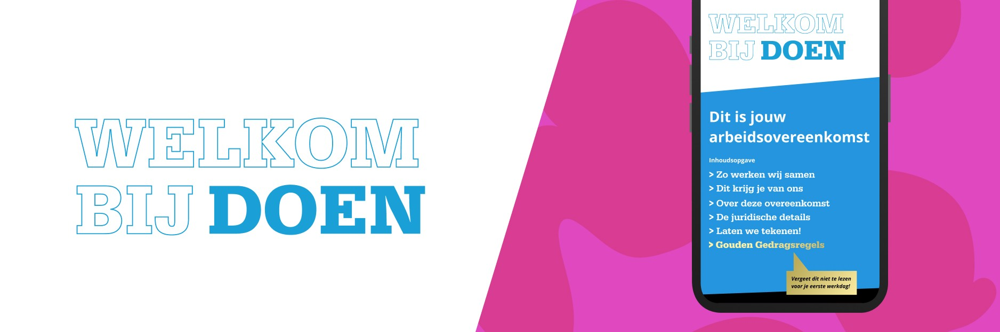

LC Energy bouwt zonne-energiesystemen op landbouwgrond. Daarvoor zijn partnerschappen met boeren essentieel. Hoe creëer je vertrouwen in zo'n omgeving? We hebben de term sheet en de proces explainer van het bedrijf opnieuw ontworpen. De explainer toont het hele samenwerkingsproces van begin tot eind. Het bieden van een groter geheel leidt tot transparantie. En transparantie schept vertrouwen.

## Weg met kleine lettertjes

Potentiële klanten moeten de voorgestelde deal gemakkelijk kunnen begrijpen. Geen tekstblokken waarin verdachte clausules verborgen kunnen zitten. Geen ingewikkelde taal die uren duurt om te begrijpen. Partijen moeten tijdens de bijeenkomst op één lijn zitten. Daarvoor is duidelijke taal nodig. Bijvoorbeeld, in plaats van een juridische naam 'term sheet' heet het document 'Ons aanbod'. Zowel rechten als plichten staan duidelijk in de term sheet. De verplichtingen zijn niet verstopt in kleine lettertjes.

_De intentieverklaring_

## Minimalistische vormgeving

We hebben een minimalistische vormgeving gebruikt die het streven naar transparantie benadrukt. De documenten moeten er niet uitzien als marketingmateriaal. Het idee is niet om te verkopen. Het doel is een langdurig partnerschap op te bouwen op basis van vertrouwen.

_Term sheet_

## Keukentafel

Beide juridische documenten hebben een A3-formaat. Ze kunnen tijdens de bespreking gemakkelijk op de keukentafel worden gelegd. De lege plekken worden ingevuld en overeengekomen wijzigingen worden voor de ogen van de boer doorgevoerd op een tastbaar stuk papier. Niets wordt verborgen, de documenten krijgen vorm in samenwerking.
